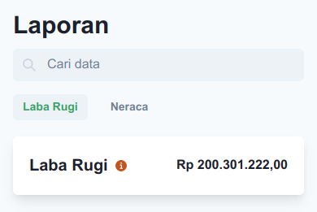

# Explanation
> Penjelasan pemilihan interaksi pada halaman.

Penempatan fitur pencarian data diatas navigasi halaman **Laba Rugi** dan **Neraca** lebih memudahkan pengguna untuk mencari data, dan memberikan konteks pencarian "apakah data dari **Laba Rugi** atau **Neraca**".

Menampilkan total nilai **Laba Rugi** langsung di bawah navigasi memberikan kemudahan akses informasi tentang total nilai dari **Laba Rugi**.

Kartu data dengan warna dan *icon* memudahkan pengguna untuk cepat mengingat dan mengenali sebuah data, sehingga hal ini lebih memudahkan pengguna untuk mendapatkan informasi dengan lebih cepat dan mudah.

Tampilan halaman seperti demikian adalah solusi tentang penyajian data yang ringkas dan *meaningful* dengan menyertakan data yang secukupnya yang membuat pengguna lebih cepat beradaptasi dengan aplikasi.
